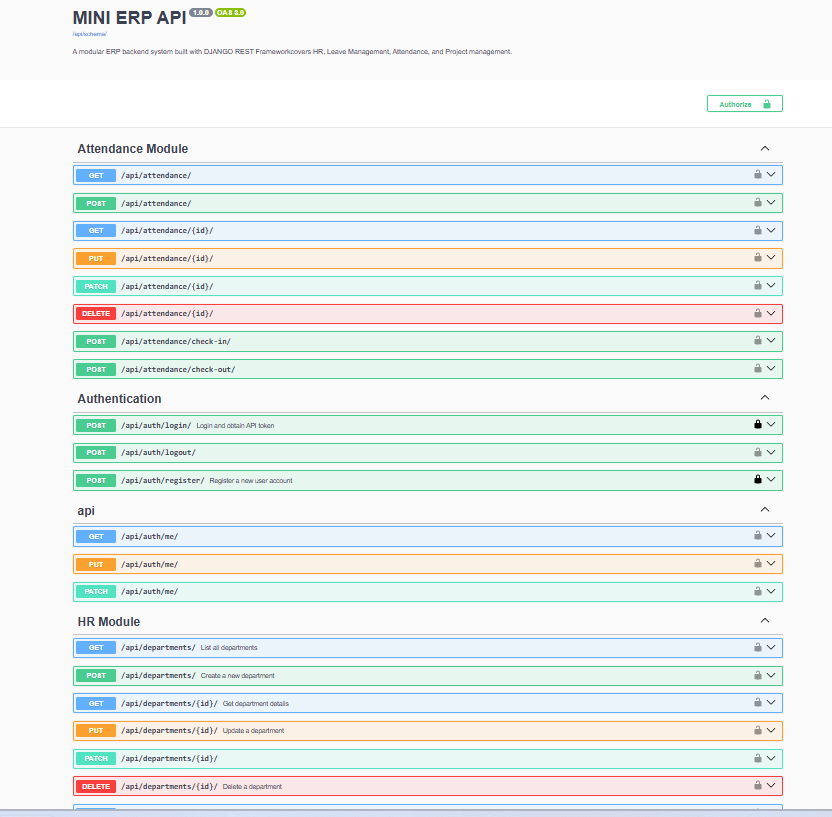

# 🏢 Mini ERP Backend System

A production-grade, modular **Enterprise Resource Planning (ERP)**
backend system built with **Python**, **Django**, and **Django REST
Framework**.

This system serves as a central hub for managing **Human Resources**,
**Attendance**, **Leave Requests**, and **Project Tracking**.

------------------------------------------------------------------------

## 🚀 Project Overview

The project follows a clean, scalable architecture composed of five core
Django applications:

-   **Accounts** -- Token-based authentication and user management
-   **HR** -- Departments, positions, and comprehensive employee
    profiles
-   **Leave Management** -- Leave types, requests, balances, and
    multi-level approval workflows
-   **Attendance** -- Daily check-in/check-out tracking with IP and
    location logging
-   **Project Management** -- Project lifecycle, team assignments, and
    task management

------------------------------------------------------------------------

## 🛠 Technologies Used

  Category                 Technology
  ------------------------ ------------------------------------------------------
  Language                 Python 3.11+
  Framework                Django 4.2+
  API Toolkit              Django REST Framework (DRF) 3.15+
  Documentation            Swagger / OpenAPI 3.0 (drf-spectacular)
  Database                 SQLite (Development) • PostgreSQL (Production-ready)
  Environment Management   python-decouple
  Testing                  Django TestCase / APITestCase

------------------------------------------------------------------------

## ⚙️ Setup Instructions

### 1. Clone the Repository

``` bash
git clone https://github.com/Firaaool/mini-erp.git
cd mini-erp
```

### 2. Create and Activate Virtual Environment

``` bash
python -m venv erp_env
erp_env\Scripts\activate  # Windows
source erp_env/bin/activate  # Linux / macOS
```

### 3. Install Dependencies

``` bash
pip install -r requirements.txt
```

### 4. Configure Environment Variables

Create a `.env` file:

``` env
SECRET_KEY=your-secret-key
DEBUG=True
ALLOWED_HOSTS=127.0.0.1,localhost
```

### 5. Run Migrations

``` bash
python manage.py makemigrations
python manage.py migrate
```

### 6. Create Superuser

``` bash
python manage.py createsuperuser
```

### 7. Run Server

``` bash
python manage.py runserver
```

## Swagger Screenshot

## 
------------------------------------------------------------------------

## 📋 API Endpoints

### Authentication

-   POST /api/auth/register/
-   POST /api/auth/login/
-   POST /api/auth/logout/
-   GET /api/auth/me/

### HR

-   GET /api/departments/
-   GET /api/employees/
-   POST /api/employees/
-   GET /api/employees/{id}/profile/

### Leave & Attendance

-   POST /api/leaves/
-   POST /api/leaves/{id}/approve/
-   POST /api/attendance/check-in/
-   POST /api/attendance/check-out/

------------------------------------------------------------------------

## 🧪 Testing

``` bash
python manage.py test tests --verbosity=2
```

------------------------------------------------------------------------

## 📖 Documentation

-   Swagger: http://127.0.0.1:8000/api/docs/
-   Redoc: http://127.0.0.1:8000/api/redoc/

------------------------------------------------------------------------

## 👤 Author

Firaol Yigezu\
Software Engineer

GitHub: https://github.com/Firaaool\
Email: wyigezu@gmail.com
